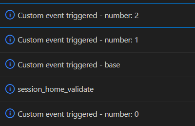
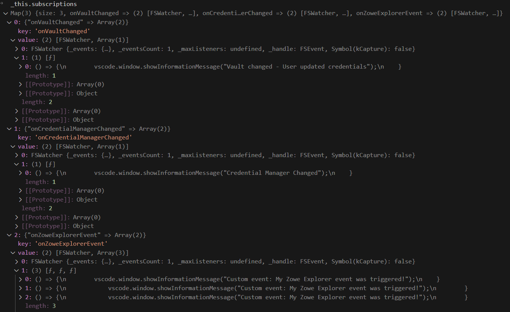

# Sample VSCode Extension

Demonstrates adding a new command to the context menu shown when a tree item is right-clicked in Zowe Explorer.

The `contributes` section of "package.json" defines a few menu items for all tree views that have an ID starting with `zowe.`.

In "extension.ts" many commands are registered which run when the menu item is clicked.

## Running the sample

- Open this sample in VS Code
- `yarn`
- `yarn compile`
- `F5` to start debugging

**Note:** Please update the `<commit-hash>` in the resolution of the Imperative package if/when making changes to the Imperative codebase
```jsonc
  "resolutions": {
    "@zowe/imperative": "https://gitpkg.now.sh/zowe/zowe-cli/packages/imperative?7730aba8a3344230661722ad9bcf09605f2adcc7"
  },
```

## Screenshots

We will perform all actions (callbacks) with a single trigger if there are multiple subscriptions to the same event


And here is what the subscription map looks like



